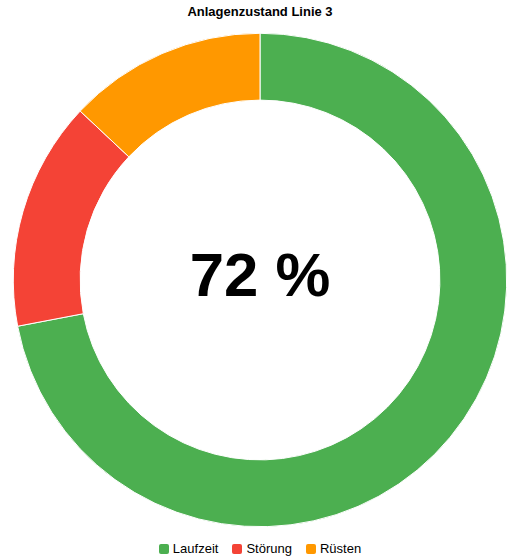
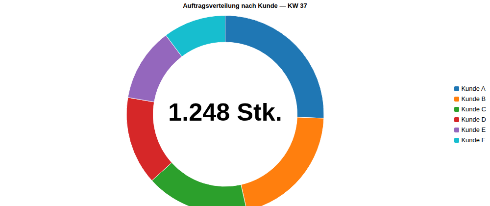

# CWC-Piechart

**Donut-Chart für WinCC Unified** — Custom Web Control zur Darstellung von Anteilswerten (z. B. Maschinenzustand, Auftrags- oder Stückzahlverteilung) als animierbarer Donut mit Legende, vollständig über JSON-Properties konfigurierbar. Reines SVG, keine externe Bibliothek.

---

## Features

- **Segments per Property** — Label, Wert und Farbe frei aus TIA Portal oder WinCC-Skript setzbar, beliebig viele Segmente (1–6 empfohlen)
- **Reines SVG** — kein Rendering-Framework, keine externe Bibliothek, kein Internet erforderlich
- **Kennzahl in der Mitte** — optionaler `CenterText` (z. B. Prozentwert oder Gesamtsumme)
- **Automatische Legenden-Position** — je nach Seitenverhältnis des Controls unten oder rechts
- **SegmentClicked-Event** — WinCC wird benachrichtigt, wenn ein Segment angeklickt wird
- **Responsive** — Diagramm passt sich bei Größenänderung des Controls automatisch an
- Einsetzbar in **Faceplates**, Popups und normalen Bildern

---

## Voraussetzungen

- WinCC Unified (TIA Portal)
- Panel oder PC Runtime mit Chromium-basiertem Browser

---

## Disclaimer / Haftungsausschluss

**English**

This software is provided "as is", without warranty of any kind, express or implied.
The author makes no representations or warranties regarding the accuracy, completeness,
or suitability of this software for any particular purpose.

This control is designed exclusively for the **display** of process data in WinCC Unified.
It does not write to, modify, or interfere with any PLC program, machine configuration,
or control system.

The author assumes no liability for any direct, indirect, incidental, or consequential
damages arising from the use or inability to use this software, including but not limited to:

- Incorrect or delayed display of process values
- Data loss or data corruption
- Unplanned machine downtime or production loss
- Damage to equipment or infrastructure
- Personal injury or property damage

Use in safety-relevant systems (functional safety, SIL, Performance Level) is explicitly
not recommended without independent verification by a qualified engineer.

By using this software, you agree that you use it entirely at your own risk.

**Deutsch**

Diese Software wird ohne jegliche ausdrückliche oder implizite Gewährleistung bereitgestellt.
Der Autor übernimmt keine Garantie für die Korrektheit, Vollständigkeit oder Eignung der
Software für einen bestimmten Zweck.

Dieses Control dient ausschließlich der **Anzeige** von Prozessdaten in WinCC Unified.
Es nimmt keine Änderungen an SPS-Programmen, Maschinenkonfigurationen oder Steuerungssystemen vor.

Der Autor übernimmt keine Haftung für direkte, indirekte oder Folgeschäden, die aus der Nutzung
oder Nichtnutzbarkeit dieser Software entstehen, einschließlich, aber nicht beschränkt auf:

- Fehlerhafte oder verzögerte Anzeige von Prozesswerten
- Datenverlust oder Datenbeschädigung
- Ungeplante Maschinenstillstände oder Produktionsausfälle
- Schäden an Anlagen oder Infrastruktur
- Personen- oder Sachschäden

Die Verwendung in sicherheitsrelevanten Systemen (funktionale Sicherheit, SIL, Performance Level)
wird ohne unabhängige Prüfung durch einen qualifizierten Ingenieur ausdrücklich nicht empfohlen.

Mit der Nutzung dieser Software erklärst du dich damit einverstanden, dass du sie auf eigenes Risiko verwendest.

---

## Installation in TIA Portal

1. Projektordner als ZIP packen — Dateiname = GUID aus `manifest.json`, Uppercase in `{}`:
   ```
   {8D53A129-5ED7-45AB-932C-F8272524AD3B}.zip
   ```
2. ZIP kopieren nach:
   ```
   C:\Program Files\Siemens\Automation\Portal V21\Data\Hmi\CustomControls\
   ```
   (oder projektspezifisch nach `[Projekt]\UserFiles\CustomControls\`)
3. TIA Portal **komplett** neu starten (nicht nur Projekt neu laden)
4. Toolbox → **Werkzeuge → Eigene Controls → Aktualisieren**
5. Control per Drag & Drop auf ein Bild ziehen

### Update

Neue ZIP ersetzen → TIA Portal neu starten → Projekt kompilieren → laden.

---

## Properties

Alle Properties sind im TIA Portal Inspektorfenster unter **Eigenschaften → Verschiedenes → Schnittstelle** konfigurierbar, `Segments` am praktikabelsten per WinCC-Skript setzen.

| Property | Typ | Beschreibung |
|---|---|---|
| `Title` | string | Optionale Überschrift über dem Diagramm |
| `Segments` | string (JSON) | JSON-codiertes Array der Segmente: `{ label: string, value: number, color: string }` |
| `ShowLegend` | boolean | Legende ein-/ausblenden (Standard: `true`) |
| `CenterText` | string | Optionale Kennzahl in der Mitte des Donuts (leer = nichts anzeigen) |

`value` ist eine positive Zahl (nicht zwingend ein Prozentwert) — das Control berechnet die prozentualen Anteile selbst. `color` ist ein CSS-Farbstring (Hex oder `rgb()`). Ungültige oder leere `Segments` führen zu einem leeren Chart, nicht zu einem Fehler.

> **Wichtig 1 — Zugriffspfad:** Properties **müssen** per Skript immer über `.Properties.X` geschrieben werden — `Screen.Items("PieChart_1").Properties.Title = "..."`, **nicht** `Screen.Items("PieChart_1").Title = "..."`.
>
> **Wichtig 2 — keine Arrays direkt zuweisen:** `Segments` ist bewusst als `string`-Property (nicht als natives Array-of-Object) deklariert. Direktes Zuweisen eines JS-Arrays führt zu einem generischen COM-Fehler (`PROPERTY_SET Invoke failed`, `0x80000005`). Die Daten müssen daher per `JSON.stringify(...)` übertragen werden (siehe Beispiele unten).

---

## Events

| Event | Argumente | Beschreibung |
|---|---|---|
| `Ready` | — | CWC ist vollständig initialisiert |
| `SegmentClicked` | `index: number`, `label: string` | Benutzer hat ein Segment angeklickt |

---

## Beispiel 1: Maschinenzustand (Legende unten)

Klassische OEE-Darstellung mit drei Segmenten und Kennzahl in der Mitte. Bei annähernd quadratischem Seitenverhältnis (Breite ≤ 1,3 × Höhe) wird die Legende automatisch unterhalb des Donuts platziert.



*Gerendert per Headless-Chromium mit WebCC-Stub.*

### WinCC-Integration

```javascript
// Im Bildskript, z. B. bei Bild.OnLoaded oder einem zyklischen Trigger:
export function PieChart_1_LoadData(item) {
    var segments = [
        { label: "Laufzeit", value: 72, color: "#4CAF50" },
        { label: "Störung",  value: 15, color: "#F44336" },
        { label: "Rüsten",   value: 13, color: "#FF9800" }
    ];

    Screen.Items("PieChart_1").Properties.Title = "Anlagenzustand Linie 3";
    Screen.Items("PieChart_1").Properties.Segments = JSON.stringify(segments);
    Screen.Items("PieChart_1").Properties.CenterText = "72 %";
}

// Reaktion auf Segment-Klick:
export function PieChart_1_SegmentClicked(item, index, label) {
    HMIRuntime.Trace("PieChart-Segment angeklickt: " + label + " (Index " + index + ")");
}
```

---

## Beispiel 2: Auftragsverteilung (Legende rechts)

Sechs Segmente bei breitem Seitenverhältnis — die Legende wird automatisch rechts neben dem Donut platziert, sobald die Breite des Controls mehr als das 1,3-fache der Höhe beträgt.



*Gerendert per Headless-Chromium mit WebCC-Stub, Beispieldaten unten.*

### WinCC-Integration

```javascript
// Im Bildskript, z. B. bei Bild.OnLoaded oder einem zyklischen Trigger:
export function PieChart_2_LoadData(item) {
    var segments = [
        { label: "Kunde A", value: 320, color: "#1f77b4" },
        { label: "Kunde B", value: 260, color: "#ff7f0e" },
        { label: "Kunde C", value: 210, color: "#2ca02c" },
        { label: "Kunde D", value: 180, color: "#d62728" },
        { label: "Kunde E", value: 150, color: "#9467bd" },
        { label: "Kunde F", value: 128, color: "#17becf" }
    ];

    var total = segments.reduce(function(sum, s) { return sum + s.value; }, 0);

    Screen.Items("PieChart_2").Properties.Title = "Auftragsverteilung nach Kunde — KW 37";
    Screen.Items("PieChart_2").Properties.Segments = JSON.stringify(segments);
    Screen.Items("PieChart_2").Properties.CenterText = total.toLocaleString("de-DE") + " Stk.";
}
```

---

## Projektstruktur

```
CWC-Piechart/
├── manifest.json           CWC-Manifest (Properties/Events-Vertrag)
├── assets/                 Icon
└── control/
    ├── index.html          Entry Point
    ├── code.js             WebCC-Bootstrap
    ├── piechart.js          Rendering-Logik (reines SVG)
    ├── styles.css
    └── js/                 Lokal gebundelte Bibliothek (webcc)
```

---

## Mitwirken

Siehe [CONTRIBUTING.md](CONTRIBUTING.md) — Beiträge unterliegen zusätzlich zur
[GNU General Public License v3.0](LICENSE) dem [Contributor License Agreement](.github/CLA.md).

---

## Drittlizenzen

| Bibliothek | Lizenz | Quelle |
|---|---|---|
| WebCC (webcc.min.js) | Siemens, Bestandteil von WinCC Unified | https://support.industry.siemens.com/cs/ww/de/view/109779176 |

---

## Lizenz

[GNU General Public License v3.0](LICENSE)
